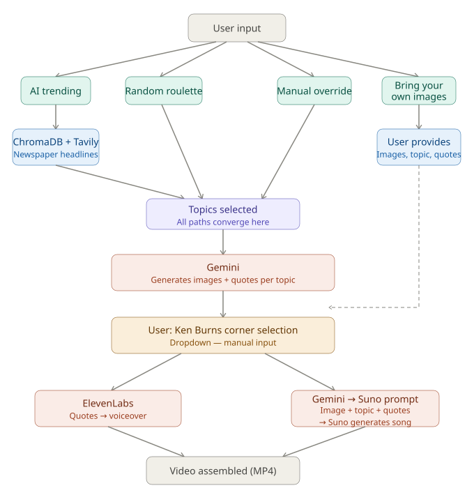

# 🎬 Multi-Modal AI Orchestration Engine

> **Note to Developers:** This repository contains the core orchestration engine. For intellectual property reasons, proprietary prompt templates (`data/prompts/`), branding assets, and specific font files (`font/`) have been intentionally excluded. To run this pipeline locally, you will need to supply your own `.ttf` fonts, placeholder `.txt` templates, and API keys.

## 📌 Overview
This repository houses an end-to-end, multi-modal generative AI pipeline designed to autonomously research, script, narrate, score, and render short-form video content. 

Rather than a simple linear script, this system is built on strict **Hexagonal Architecture (Ports and Adapters)**, featuring a Human-in-the-Loop (HITL) Streamlit state machine that orchestrates 5 different AI models and APIs simultaneously.



## 🏗️ Architecture & Design Patterns

### Hexagonal Architecture (Ports and Adapters)
The codebase strictly separates the domain logic from external dependencies. If a provider's API changes, only the specific adapter needs to be updated; the core orchestrators remain untouched.
* **Domain/Services:** Contains the pure business logic (Video Orchestrator, Trend Orchestrator, Voice Pipeline).
* **Ports:** Abstract interfaces defining what the engine needs (e.g., `TextGenerationPort`, `VoiceGenPort`, `VideoRendererPort`).
* **Adapters:** Concrete implementations handling external APIs and libraries.
  * **LLM / Vision / Embeddings:** Gemini Pro / Flash
  * **Voice Synthesis:** ElevenLabs API
  * **Music Generation:** Suno API
  * **Search / Trends:** Tavily API
  * **Vector Database:** ChromaDB
  * **Video / Audio Processing:** OpenCV, MoviePy, Librosa

### Human-in-the-Loop (HITL) State Machine
The UI (`ui.py`) is not just a static dashboard; it is a complex state machine built with Streamlit. It pauses the autonomous pipeline to allow for human creative direction:
* **Generative Branching:** Automatically generates multiple visual options per topic.
* **State Management:** Users can safely skip, navigate backward, and override dynamic variables (like Ken Burns camera panning angles) without losing session state or triggering redundant API calls.
* **Dependency Injection:** `@st.cache_resource` is utilized to load heavy AI embedding models and audio analyzers only once into memory, drastically reducing latency during the HITL workflow.

## 🚀 Key Features
* **Dynamic Audio Synchronization:** Uses `librosa` to analyze generated audio tracks, algorithmically finding the "epic drop" to synchronize visual and scene transitions.
* **Context-Aware Typography:** OpenCV dynamically calculates text wrapping and contrasting border colors based on the AI-generated dominant color palettes of the background images.
* **RAG-Powered Trend Generation:** Queries ChromaDB and Tavily to generate content strictly based on current internet trends and curated psychological frameworks.

*(Space reserved for future UI Screenshots)*

## 💻 Developer Setup

This pipeline is designed for developers comfortable with managing complex Python environments and API ecosystems.

1. **Environment Variables:** Create a `.env` file in the root directory with the following keys:
   * `API_KEY` (Google Gemini)
   * `XI_API_KEY` (ElevenLabs)
   * `SUNO_API_KEY`
   * `TAVILY_API_KEY`
2. **System Dependencies:** Ensure you have system-level libraries installed for OpenCV and audio processing (e.g., `ffmpeg`).
3. **Python Dependencies:** Install the required packages listed in `requirements.txt`.
4. **Missing Assets:** You must create a `font/` directory with a valid `.ttf` file and populate `data/prompts/` with your own `.txt` instruction templates before execution.
5. **Execution:** Launch the HITL studio via Streamlit:

   ```bash
   streamlit run ui.py
   ```

## 🐳 Run with Docker

The Streamlit app can also be run in a container, which bundles Python 3.10 and all system dependencies (ffmpeg, libsndfile, OpenCV runtime libs).

1. Create your `.env` file as described above (`API_KEY`, `XI_API_KEY`, `SUNO_API_KEY`, `TAVILY_API_KEY`, plus `SPANISH_VOICE_ID`, `EMBEDDING_MODEL`, `LLM_MODEL`, `IMAGE_MODEL`, `SUNO_MODEL`).
2. Make sure `font/` and `data/prompts/` already exist locally with your assets/templates — these are bind-mounted into the container, not baked into the image.
3. Build and start the app:

   ```bash
   docker compose up --build
   ```

4. Open `http://localhost:8501`.

Generated output (`data/`), the ChromaDB vector store (`chroma_storage/`), and fonts (`font/`) are bind-mounted from the host so they persist across container restarts.

## 🎹 Running `key_player.py`

`key_player.py` replays recorded keystrokes into whatever window on your machine currently has focus (via `pyautogui`/`pynput`). It needs direct control of your real keyboard, so it cannot run inside Docker — run it natively instead:

```bash
run_key_player.bat
```

This activates the local `.venv` and runs `python key_player.py`. It expects a `recorded_keys.txt` file next to it, and its extra dependencies (`pyautogui`, `pynput`, etc.) are listed separately in `requirements-key_player.txt`.
